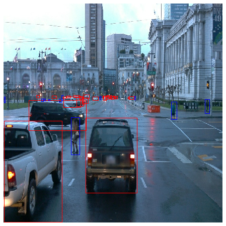
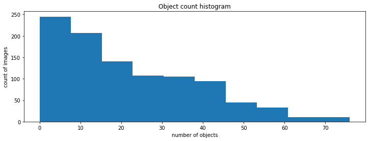

### Project overview
In this project, we make use of tensorflow object detection API to train a custom object detector. All the training and testing dataset were from the [Waymo Open dataset](https://waymo.com/open/). This project was done on a local machine with NVIDIA GeForce GTX 1050 on a docker container. Steps to build and setting up the docker container are described in `build`. Next, we will go through the pipeline of training a tensorflow model including exploratory data analysis, splitting the dataset, model training, model improvement, and exporting a trained model. Finally, a short video for our prediction will be generated to showcase the result.

### Structure
This project is organized as follows:
* `build` contains instructions to build the docker image and to run a container.
* `download_process.py` will download original tf record files to `data/raw` before processing these files and saving them into `data/processed`. After `create_splits.py` is run, processed data will be moved into `train`,`val`, and `test` with ratios explained in a later section.
```
data
|--processed
|--raw
|--test
|--train
|--val
```
* The `pretrained_model` directory contains our downloaded SSD tf model. The `reference` directory contains `pipeline_new.config`, checkpoint files, `eval` and `train` folders containing evaluation and training events files respectively, `exported` directory containing a saved model. A similar structure applies to `improved` directory.
```
experiments
|--improved
|--pretrained_model
|--reference
|--exporter_main_v2.py
|--label_map.pbtxt
|--model_main_tf2.py
```
_* `model_main_tf2.py` to train or evaluate a model.
_* `exporter_main_v2.py` to convert trained model to a more compact inference model.
_* `label_map.pbtxt` 
* `video` folder stores both resultant inference video from both reference model and improved model.
* `plots` contains tensorboard plots.
* `images` contains images for this README.md file

the files directly under project folder:
* `download_process.py`
* `create_splits.py`
* `edit_config.py`
* `inference_video.py`
* `utils.py` 
* `Exploratory Data Analysis.ipynb`
* `Explore augmentations.ipynb`

### Set up
#### Download dataset
The dataset is avaiable under as tar files or from the [Google Cloud Bucket](https://console.cloud.google.com/storage/browser/waymo_open_dataset_v_1_2_0_individual_files/) as individual tf records. We will download the a portion of the files from cloud (not manually). To download the dataset:

1) Build a docker image as instructed in `build` folder. Run a docker container by running (modify based on your username):
`docker run --shm-size=256m --gpus all -v /home/reinaldy/Documents/nd013-c1-vision-starter:/app/project/ --network=host -ti project-dev bash`

2) Install gcloud:
`curl https://sdk.cloud.google.com | bash`
authorize login:
`gcloud auth login`

Before downloading, we need to make sure necessary libraries are installed:
```
pip install pyparsing==2.4.2
pip install avro-python3==1.10.0
pip install matplotlib==3.1.1
pip install absl-py==0.13
```
3) try downloading in small batch first:
```
CUDA_VISIBLE_DEVICES=0
python download_process.py --data_dir /app/project/data --size 5
```
make sure that 5 tf record files has been downloaded. 

4) Finally, run:
`python download_process.py --data_dir /app/project/data`
which will download 100 tf records to `/app/project/data/raw` directory. This will take some time.

For this project we only need a subset of the data provided (for example, we do not need the Lidar data). Therefore, we are going to download and trim immediately for each file. The `download_process.py` script will download original tf record files into `data/raw` and processed data will be stored in `data/processed`. Later, the raw data will be removed to save space.

```
def create_tf_example(filename, encoded_jpeg, annotations, resize=True):
    """
    This function create a tf.train.Example from the Waymo frame.

    args:
        - filename [str]: name of the image
        - encoded_jpeg [bytes]: jpeg encoded image
        - annotations [protobuf object]: bboxes and classes

    returns:
        - tf_example [tf.Train.Example]: tf example in the objection detection api format.
    """
    if not resize:
        # load the input encoded image into memory buffer using python BytesIO input/output library
        encoded_jpg_io = io.BytesIO(encoded_jpeg)
        image = Image.open(encoded_jpg_io)
        # extracts width and height information from this image
        width, height = image.size
        width_factor, height_factor = image.size
    else:
        # read the image as a tensor of uint8 type
        image_tensor = tf.io.decode_jpeg(encoded_jpeg)
        height_factor, width_factor, _ = image_tensor.shape
        image_res = tf.cast(tf.image.resize(image_tensor, (640, 640)), tf.uint8)
        encoded_jpeg = tf.io.encode_jpeg(image_res).numpy()
        width, height = 640, 640

    mapping = {1: 'vehicle', 2: 'pedestrian', 4: 'cyclist'}
    image_format = b'jpg'
    xmins = []
    xmaxs = []
    ymins = []
    ymaxs = []
    classes_text = []
    classes = []
    filename = filename.encode('utf8')

    for ann in annotations:
        xmin, ymin = ann.box.center_x - 0.5 * ann.box.length, ann.box.center_y - 0.5 * ann.box.width
        xmax, ymax = ann.box.center_x + 0.5 * ann.box.length, ann.box.center_y + 0.5 * ann.box.width
        xmins.append(xmin / width_factor)
        xmaxs.append(xmax / width_factor)
        ymins.append(ymin / height_factor)
        ymaxs.append(ymax / height_factor)
        classes.append(ann.type)
        classes_text.append(mapping[ann.type].encode('utf8'))

    tf_example = tf.train.Example(features=tf.train.Features(feature={
        'image/height': int64_feature(height),
        'image/width': int64_feature(width),
        'image/filename': bytes_feature(filename),
        'image/source_id': bytes_feature(filename),
        'image/encoded': bytes_feature(encoded_jpeg),
        'image/format': bytes_feature(image_format),
        'image/object/bbox/xmin': float_list_feature(xmins),
        'image/object/bbox/xmax': float_list_feature(xmaxs),
        'image/object/bbox/ymin': float_list_feature(ymins),
        'image/object/bbox/ymax': float_list_feature(ymaxs),
        'image/object/class/text': bytes_list_feature(classes_text),
        'image/object/class/label': int64_list_feature(classes),
    }))
    return tf_example
```
#### Edit the config file
The Tf Object Detection API relies on config files. The config that we will use for reference is `pipeline.config`, which is the config for a SSD Resnet 50 640x640 model. The [pretrained model](http://download.tensorflow.org/models/object_detection/tf2/20200711/ssd_resnet50_v1_fpn_640x640_coco17_tpu-8.tar.gz) was placed under `app/project/experiments/pretrained_model`. The paper for Single Shot Detector can be read [here](https://arxiv.org/pdf/1512.02325.pdf). Other architectures can be viewed in the Tf Object Detection API [model zoo](https://github.com/tensorflow/models/blob/master/research/object_detection/g3doc/tf2_detection_zoo.md). 

We neet to edit the config files to change the location of the training and validation files, as well as the location of the label_map file, pretrained weights. We also need to adjust the batch size. To do so, run:
`python edit_config.py --train_dir /app/project/data/train --eval_dir /app/project/data/val --batch_size 2 --checkpoint /app/project/experiments/pretrained_model/ssd_resnet50_v1_fpn_640x640_coco17_tpu-8/checkpoint/ckpt-0 --label_map /app/project/experiments/label_map.pbtxt`

A new config file will be created, `pipeline_new.config`. This new config file can be placed to the `/app/project/experiments/reference` folder.

#### Model training and evaluation
To resume on a docker container previously created:
```
docker start  `docker ps -q -l` # restart it in the background
docker attach `docker ps -q -l` # reattach the terminal & stdin
```
To train the reference model, run:
```
python /app/project/experiments/model_main_tf2.py --model_dir=experiments/reference --pipeline_config_path=experiments/reference/pipeline_new.config
```
Open a new terminal and run:
```
docker exec -it <container-id> bash
```
where `<container-id>` is the id of the currently running container, which can be checked using:
`docker ps -a`
launch the evaluation process simultaneously with training process, by entering:
`CUDA_VISIBLE_DEVICES="" python /app/project/experiments/model_main_tf2.py --model_dir=experiments/reference/ --pipeline_config_path=experiments/reference/pipeline_new.config --checkpoint_dir=experiments/reference/`
To view tensorboard, open another new terminal running in the same docker id as described previously and enter:
`python -m tensorboard.main --logdir /app/project/experiments/reference/`

Improve the model by editing the the `pipeline_new.config` file. To do so in Sublime text editor, we need the power as a root user:
`sudo subl pipeline_new.config`
Similar training commands as the reference model can be used to training the improved model by replacing `reference` directory name to `improved` as detailed above.

#### Export model
After the training has finished, export the trained model by running:
`python /app/project/experiments/exporter_main_v2.py --input_type image_tensor --pipeline_config_path experiments/reference/pipeline_new.config --trained_checkpoint_dir experiments/reference/ --output_directory experiments/reference/exported/`
Finally a short video of the model inference for any tf record file can be generated, as an example:
`python /app/project/inference_video.py --labelmap_path label_map.pbtxt --model_path experiments/reference/exported/saved_model --tf_record_path /app/project/data/test/segment-10212406498497081993_5300_000_5320_000_with_camera_labels.tfrecord --config_path experiments/reference/pipeline_new.config --output_path animation.mp4`

### Dataset
#### Dataset analysis
The dataset consists of urban and highway environment. In this project we will be focusing on three classes only, namely:
```
item {
    id: 1
    name: 'vehicle'
}

item {
    id: 2
    name: 'pedestrian'
}

item {
    id: 4
    name: 'cyclist'
}
```

as provided in `label_map.pbtxt`.
In the `Exploratory Data Analysis` notebook, we display camera images with the corresponding annotations. An example of such image is shown below:
<p align="center">
  
</p>
The codes for displaying images are as below:

```
dataset=get_dataset("/app/project/data/processed/*.tfrecord")
from matplotlib.patches import Rectangle
%matplotlib inline

def display_instances(batch):
    colormap={1:[1,0,0],2:[0,0,1],4:[0,1,0]}
    f,ax=plt.subplots(figsize=(8,8))
    img=batch["image"]
    w,h,_=img.shape
    bboxes=batch["groundtruth_boxes"]
    cls=batch["groundtruth_classes"]
    ax.imshow(img)
    for i in range(bboxes.shape[0]):
        bbox=bboxes[i]
        cl=cls[i]
        ymin=bbox[0]*h
        ymax=bbox[2]*h
        xmin=bbox[1]*w
        xmax=bbox[3]*w
        rect=Rectangle((xmin,ymin),xmax-xmin,ymax-ymin,facecolor='none',edgecolor=colormap[cl])
        ax.add_patch(rect)
    ax.axis('off')
```

Additional insight to the dataset can be obtained through a function that displays information across tf records data struct, such as this:

<p align="center">
  
</p>

#### Cross validation
We split the dataset to train, val, and test data by commonly used ratios of 0.8, 0.1, and 0.1 respectively. Because we are doing transfer learning, the number of training examples don't have to be huge. We shuffle the dataset before splitting, this is to ensure nearly equal distribution of scenes in the three resulting dataset. The validation performance of the trained model will be poor if the training and validation set have very different scenarios. We can monitor the evaluation loss and training loss using tensorboard. If the validation loss starts increasing while training loss decreases, it could be an indication of overfitting. The test split is used to test the model's accuracy.

### Training
#### Reference experiment
Tensorboard plots for the reference model are shown below:
<p align="center">
  
</p>
with a learning plotted below:
<p align="center">
  
</p>
we observed that as the learning rate increases from initial value of 0.013333 to about 0.04, the loss increases steeply. The loss decreases along with decaying learning rate.

<p align="center">
  
</p>
From the precision curve, we learn that the model did not learn anything useful until after 8000 steps. These prompts us to improve the reference model to increase its accuracy.

#### Improve on the reference
To improve the reference model, the following modifications were made:
1) Adjust the batch size
From experimentation, using a larger batch size generally results in faster decrease in loss.
2) Lower the learning rate
The learning rate is lowered from a base value of 0.04 to 0.002.
3) Random crop for data augmentation
As per the [SSD](https://arxiv.org/pdf/1512.02325.pdf) paper, random crop was utilized to increase the model's precision. Therefore, we try implementing ssd_random_crop as given in [preprocessor.proto](https://github.com/tensorflow/models/blob/master/research/object_detection/protos/preprocessor.proto).
The resulting improved plots are given below:
1) Loss curves
<p align="center">
  
</p>
2) Precision
<p align="center">
  
</p>
3) Recall
<p align="center">
  
</p>
Comparisons can be made by viewing the inference videos available under `video`. The images below illustrate the improvement of inference accuracy.
<p align="center">
  
</p>
<p align="center">
  
</p>
